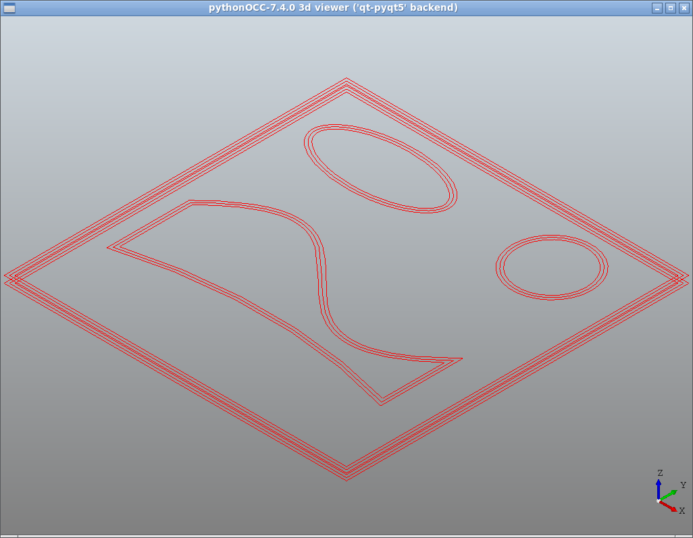
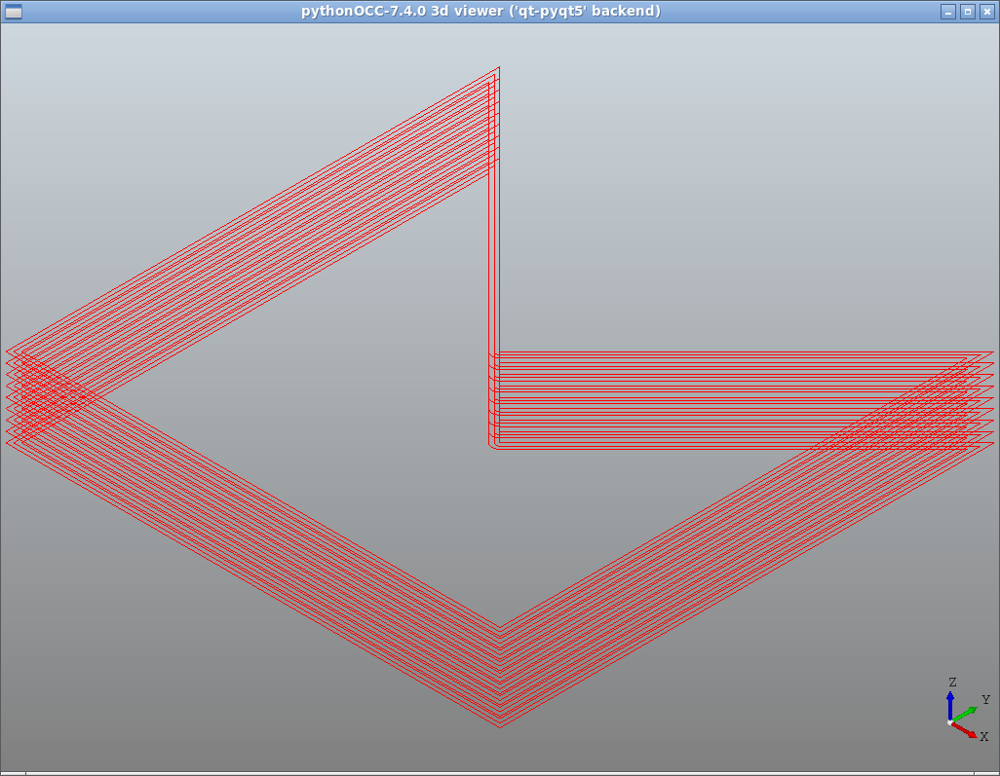
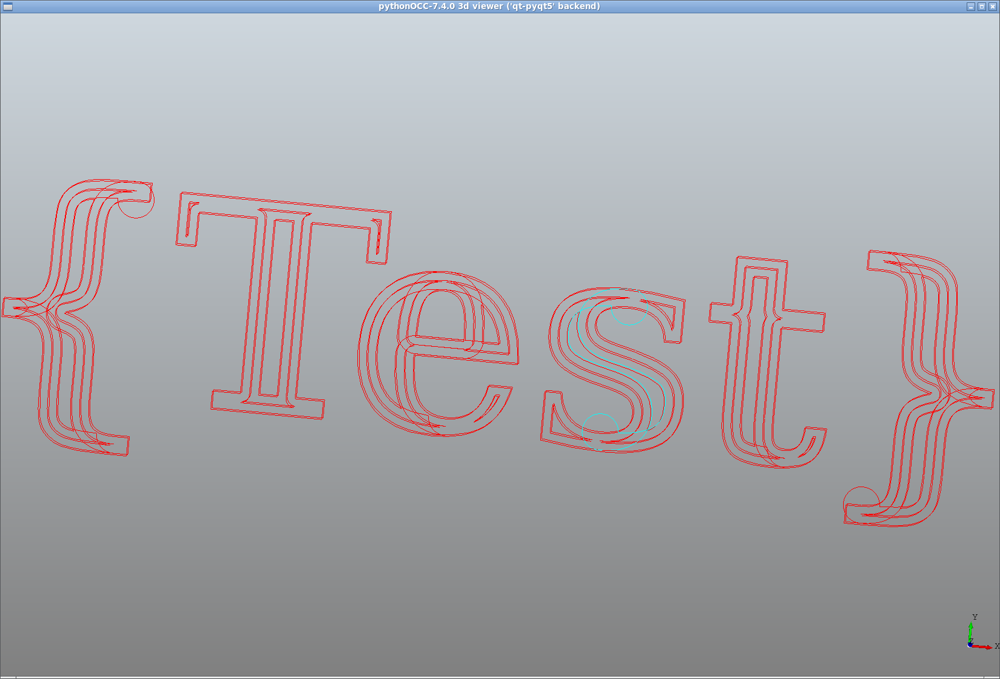
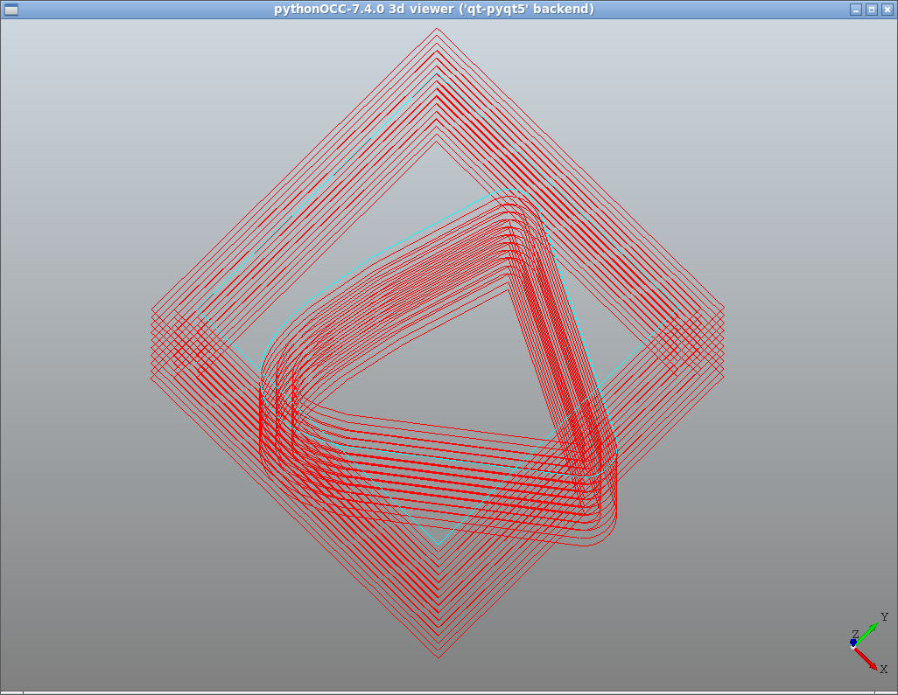

# OCCT slicer testbed

## Requirements
- Python3
- OCCT
- pythonocc-core

## Usage
python3 slicer.py <filename.step>

## Example output:

## Offset failure
OCCT's offset algorithm doesn't handle intersections

## TODO
- Subdivide curves