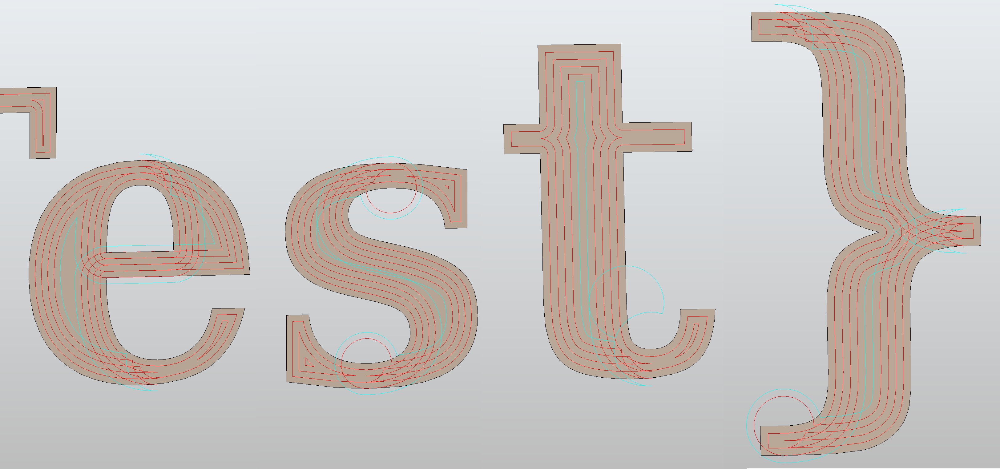

# Polyspline Offsetting

OCCT provides functionality to offset shapes (solids, shells, faces, wires, edges) via BRepOffsetAPI

- Some of the misbehavior may be due to bugs in python-occ, rather than occt itself (doubtful)
- One source of bugs may be loading from step files and running BRepAlgoAPI_Common, vs creating the geometry directly (doubtful)
- The performance is a bit poor (~1s for text_test.step, 5 offsets @ 0.2mm), but again that may be a result of the python bindings
- The offset function returns result sets. For faces with holes, the return set contains all the offset wires calculated from the offset value
- Can pass a TopoDS_Face to BRepOffsetAPI_MakeOffset, and it adds all child wires

## Interior Offsetting

- Only GeomAbs_Arc works reliably
- Simple polygons work best, but still not very robust

### Success with simple shapes

### Failure with simple shapes

### Success with complex shapes

The hole is a periodic spline

### Failure with compound curve

This is a non-periodic spline with a line segment at the endpoints. Coincidentally, that's exactly where the offset fails.

### Complex shape failure

Some self-intersections aren't pruned with complex curves

## Exterior Offsetting

- Offset type GeomAbs_Arc appears to be the only offset type working reliably, and even then, 't' is missing one offset wire
- Offsets collide with offsets of other faces (expected, this test offset each face individually)

## Potential Solutions

1. Simplify wires to curves/lines before offsetting
    - simple offsetting still not robust
    - makes converting back more difficult
    - have to do this step anyway to use alternative clipping lib
1. Check offset for self-intersections
    - may be slow, fragile
    - BRepOffset_Analyse
    - BRepOffset_Inter2d
    - BRepOffset_Tool::Deboucle3D
1. [Trim self-intersections](https://github.com/jbuckmccready/CavalierContours#raw-offset-polyline-self-intersects-dark-cyan-step-4)

How to get type of [offset curve?](https://dev.opencascade.org/doc/occt-7.6.0/refman/html/class_geom___offset_curve.html)
No idea how to get the underlying type (or pcurve) of GeomAbs_OffsetCurve
- Adaptor2d_OffsetCurve
- 

More resources

- [check wire self-intersection](https://dev.opencascade.org/doc/refman/html/class_shape_analysis___wire.html#ab82bf6094061a201fc7e5aba74576d6d)
- [fix wire self-intersection](https://dev.opencascade.org/doc/refman/html/class_shape_fix___wire.html#a871e89d7fc1b1c4f59f2e29a59ae88b1)

- [line-arc-offset-demo](https://github.com/fdarling/line-arc-offset-demo)
- [opencascade-2d-offsetting-demo](https://github.com/fdarling/opencascade-2d-offsetting-demo)
- [variable-width offset](https://github.com/BagelOrb/variable_width_paper)
- [variable-width contouring](https://github.com/mfx-inria/Variable-width-contouring)